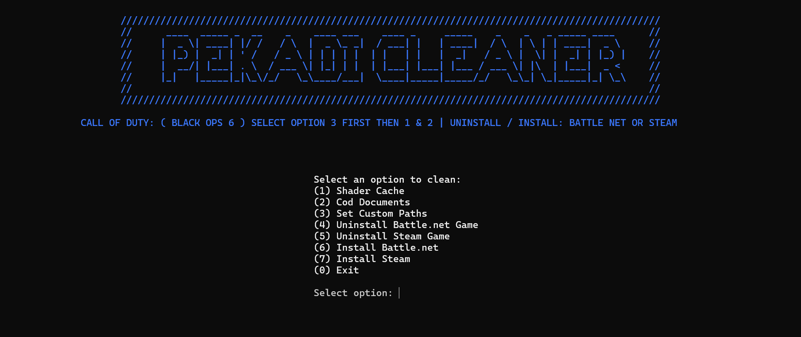

# Call of Duty Cleaner

Instructions for Using the Call of Duty Cleaner Automatic Path Detection
The tool will attempt to automatically detect the locations of the shader cache 
and Call of Duty Documents folders. If it fails to find these paths, you will be prompted to enter them manually.
------------------------------------------------------------------------------------------------------------------

:: 1. Running the tool:
Choose Option 3: This will automatically search for the shader cache and Call of Duty Documents folders across common drive letters.
If the paths are detected successfully, you’ll see a message confirming the paths.
If the paths are not detected, you can enter them manually when prompted.

:: Setting Custom Paths (If Necessary)
If the script cannot locate the paths automatically or if you need to specify different paths, you can manually set the paths as follows:

:: Battle.net Users:

Specify the path for the shader cache. Example: set shaderCachePath="D:\Call of Duty\_retail_\cod24\shadercache"
your Drive letter may be different.

----------------------------------------

:: Steam Users:

Specify the Steam path for the shader cache. Example: 
set shaderCachePath="C:\Program Files (x86)\Steam\steamapps\common\Call of Duty HQ\cod24\shadercache"
if your game is on steam but in a different drive just find where your game is intsalled follow similar path below.

:: D:\SteamLibrary\steamapps\common\Call of Duty HQ\cod24\shadercache Drive letter mae be different.

----------------------------------------

Call of Duty Documents Folder Path:
The script will look for the Documents folder in the default location:

:: C:\Users\YourUsername\Documents\Call of Duty 

If it does not find the folder, you will be prompted to enter the path manually.

----------------------------------------

IMPORTANT:

:: Backup Your Configuration File:
Backup ( s.1.0.cod24.txt ) B06 GAME SETTINGS FILE
Before running the tool, it’s recommended to copy this file from the Call of Duty Documents folder. It contains your game settings, graphics configurations, and other preferences.
Backing up this file allows you to restore your settings after running the cleaner.

:: Running the Cleaner:
Select Option 1 for cleaning the shader cache.
Select Option 2 for cleaning the Call of Duty Documents folder.
After cleaning, launch the game. You may see a "safety message" prompt—select "No" to proceed.
You will need to re-watch the intro cutscene, and the shader cache will be re-downloaded automatically.

----------------------------------------

Option 4 & 5:
:: If Battle Net or Steam has any problems its best to just uninstall the launcher.

----------------------------------------

Option 6 & 7:
:: Install Battle Net or Steam.

----------------------------------------

::  Understanding the Process:
This script deletes old shader cache files and the Call of Duty Documents folder.
Upon re-launching the game, new shader cache files and a new Documents folder will be created with default configurations.
Note: You can manually delete these files by navigating to their respective folders. The script provides a convenient, automated way to perform the cleanup.

